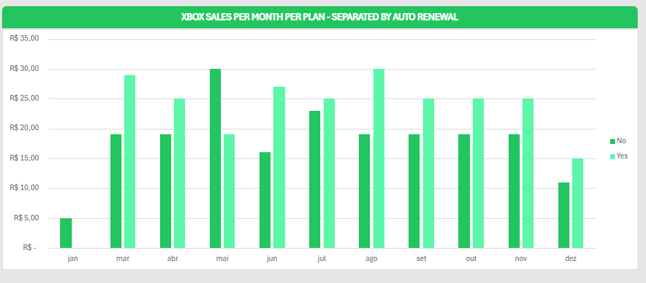
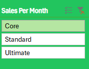
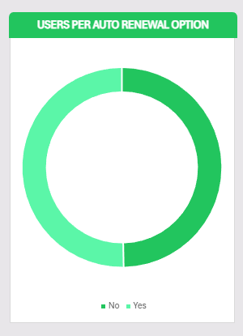
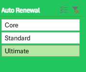

Sobre o Projeto
O objetivo principal deste desafio foi pegar a base de dados e o dashboard original propostos e aplicar melhorias estratégicas para extrair insights mais profundos. O foco das alterações foi permitir uma visão temporal das vendas e entender a adesão à renovação automática.

🚀 Melhorias e Funcionalidades Implementadas
Para elevar o nível da análise, foram realizadas as seguintes intervenções na base de dados e no layout:

1. Análise Temporal de Vendas
Tratamento de Dados: Criação de uma nova coluna calculada para isolar o mês de início da assinatura.

Visualização: Implementação de um gráfico de evolução de vendas por mês.

Interatividade: Adição de segmentação de dados (filtros) para permitir a análise cruzada por Tipo de Plano e status de Renovação Automática.

Objetivo: Permitir identificar sazonalidades e tendências de crescimento ao longo do ano.

2. KPI de Fidelização (Renovação Automática)
Visualização: Criação de um gráfico de rosca (Donut Chart) dedicado.

Métrica: Exibição clara da porcentagem (%) de usuários que possuem a renovação automática ativada versus desativada.

Interatividade: O gráfico responde aos filtros de Plano, permitindo comparar se planos mais caros ou mais baratos têm taxas de retenção automática diferentes.

